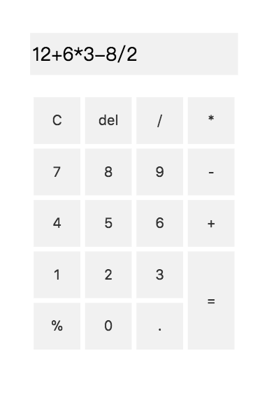

# Javascript-simple-calculator
Javascript simple calculator using notation to calculate
## Features
- support `+`、`-`、`*` and `/` operator
- using [polish notation](https://en.wikipedia.org/wiki/Polish_notation) to calculate the result

## Screenshot

